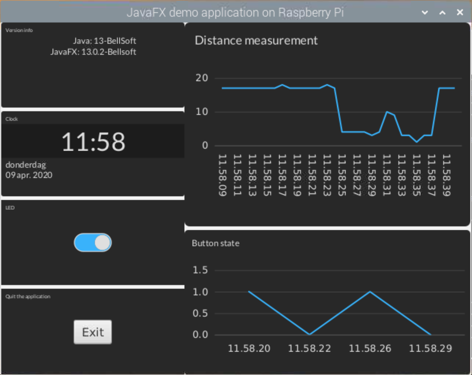
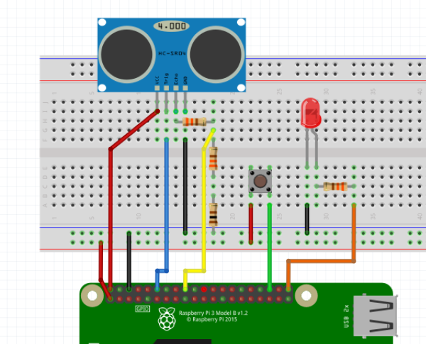

# Getting started with JavaFX on Raspberry Pi 

Example application to demonstrate the use of JavaFX on a Raspberry Pi in combination with Pi4J and some basic (and cheap) hardware components.



## Build the application

This application is a Maven project. You can run it on PC, but will not do a lot as it needs Pi4J...

To build for the Raspberry Pi:

```
mvn clean package
```

## Run on a Raspberry Pi

### Install Pi4J

```
$ curl -sSL https://pi4j.com/install | sudo bash
```

### Connect the components



### Run the application

Copy the generated file "javamagazine-javafx-example-0.0.1-jar-with-dependencies.jar" to your Pi and start it with

```
$ java -jar javamagazine-javafx-example-0.0.1-jar-with-dependencies.jar
```
